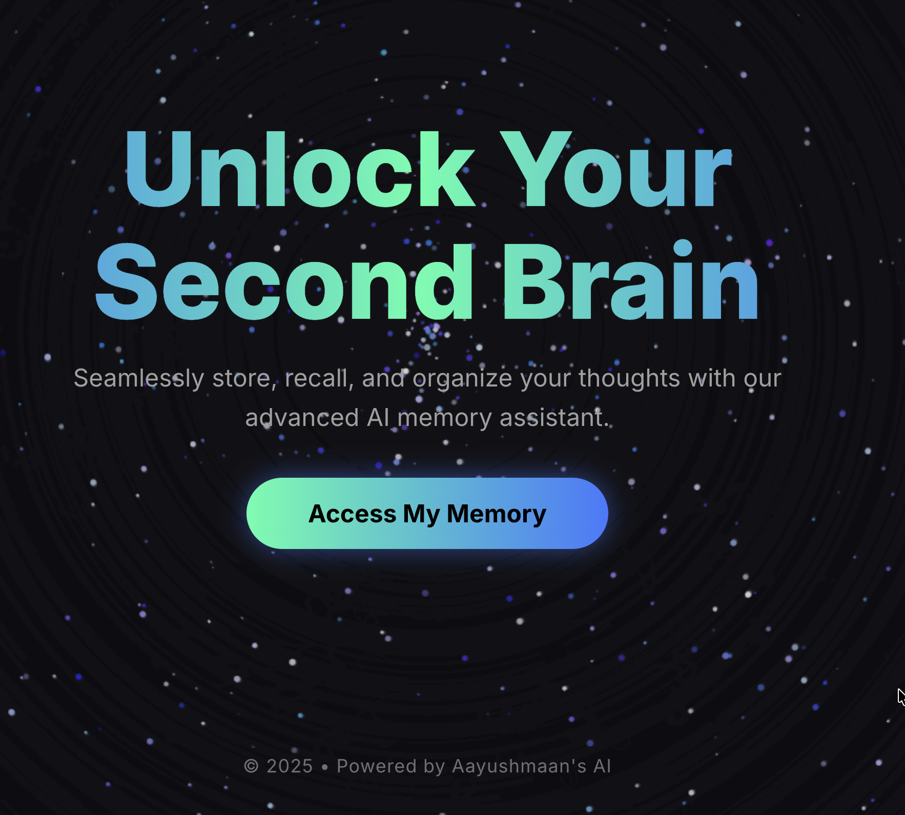

<p align="center">
  
</p>

# MyBrain - AI Memory Assistant 🧠

A full-stack application exploring **Mem0's memory capabilities** to create a personalized AI assistant that remembers your conversations and builds context over time.

## 💡 Project Idea

The core idea behind MyBrain is to explore and demonstrate **Mem0's memory management** in a practical, user-friendly application. Unlike traditional chatbots that forget everything after each session, MyBrain acts as your "second brain" - persistently storing, recalling, and building upon past conversations to provide increasingly personalized responses.

### Why Mem0?

This project was built to explore:
- **Persistent Memory**: How Mem0 stores and retrieves conversational context across sessions
- **User-Specific Memory**: Isolating memories per user using Pinecone's metadata filtering
- **Contextual Responses**: Leveraging past interactions to provide more relevant, personalized AI responses
- **Memory Search**: Using semantic search to find relevant memories for current conversations

## ✨ Features

### 🎨 Frontend
- **Interactive Galaxy Background**: Stunning particle animation on the landing page
- **Animated Gradient Text**: Eye-catching hero section with smooth gradient animations
- **Dark/Light Mode**: Theme toggle for user preference
- **Mobile Responsive**: Fully optimized for desktop, tablet, and mobile devices
- **User Status Tracking**: Visual indicator for new vs. returning users
- **Glassmorphism UI**: Modern, translucent design elements

### 🤖 Backend
- **Mem0 Integration**: Persistent memory storage and retrieval using Mem0 + Pinecone
- **LangGraph Workflow**: Structured conversation flow with memory-aware responses
- **GPT-4o Integration**: Powered by OpenAI's latest model
- **User Detection**: Automatic identification of new vs. returning users based on memory history
- **FastAPI**: High-performance REST API with CORS support

## 🏗️ Architecture

```
MyBrain/
├── frontend/               # React + Vite
│   ├── src/
│   │   ├── components/    # Reusable UI components
│   │   │   ├── animations/    # Background animations
│   │   │   └── react-bits/    # Galaxy, GradientText
│   │   ├── pages/         # Landing & Chat pages
│   │   └── App.jsx
│   └── package.json
│
└── backend/               # FastAPI + Mem0
    ├── main.py           # API endpoints
    ├── bot.py            # LangGraph chatbot logic
    ├── config.py         # Mem0 configuration
    ├── utils.py          # User existence check
    └── requirements.txt
```

## 🚀 Getting Started

### Prerequisites
- **Node.js** (v16+)
- **Python** (3.12 recommended)
- **OpenAI API Key**
- **Pinecone API Key**
- **Mem0 API Key** (optional, for managed service)

### Backend Setup

1. Navigate to the backend directory:
```bash
cd backend
```

2. Install dependencies:
```bash
pip install -r requirements.txt
```

3. Create a `.env` file with your API keys:
```env
OPENAI_API_KEY=your_openai_key
PINECONE_API_KEY=your_pinecone_key
MEM0_API_KEY=your_mem0_key  # Optional
```

4. Run the server:
```bash
python3.12 -m uvicorn main:app --reload
```

The API will be available at `http://localhost:8000`

### Frontend Setup

1. Navigate to the frontend directory:
```bash
cd frontend
```

2. Install dependencies:
```bash
npm install
```

3. Start the development server:
```bash
npm run dev
```

The app will be available at `http://localhost:5173`

## 🔧 API Endpoints

### `POST /user`
Check if a user exists in the memory database.

**Request:**
```json
{
  "user_id": "aayush"
}
```

**Response:**
```json
{
  "status": "success",
  "is_new_user": false,
  "user_id": "aayush"
}
```

### `POST /chat`
Send a message and receive a memory-aware response.

**Request:**
```json
{
  "user_id": "aayush",
  "message": "I love Formula 1"
}
```

**Response:**
```json
{
  "response": "That's great! I'll remember that you're a Formula 1 fan."
}
```

## 🧪 How Mem0 Works in This Project

1. **Memory Storage**: When you chat, both your message and the AI's response are stored in Mem0 with your `user_id`
2. **Memory Retrieval**: Before responding, the bot searches Mem0 for relevant past conversations
3. **Context Building**: Retrieved memories are injected into the system prompt, giving the AI context about you
4. **User Isolation**: Pinecone's metadata filtering ensures your memories stay separate from other users


## 🛠️ Tech Stack

### Frontend
- **React** - UI framework
- **Vite** - Build tool
- **Framer Motion** - Animations
- **Canvas API** - Galaxy background
- **Lucide React** - Icons

### Backend
- **FastAPI** - Web framework
- **LangChain** - LLM orchestration
- **LangGraph** - Conversation workflow
- **Mem0** - Memory management
- **Pinecone** - Vector database
- **OpenAI GPT-4o** - Language model

## 📝 Future Enhancements

- [ ] Memory deletion endpoint (clear specific memories)
- [ ] Memory export/import functionality
- [ ] Conversation history view
- [ ] Memory analytics dashboard
- [ ] Multi-modal memory (images, files)
- [ ] Memory sharing between users
- [ ] Advanced memory search filters

## 🤝 Contributing

This is an exploration project, but feel free to fork and experiment with Mem0's capabilities!

## 📄 License

MIT

## 👨‍💻 Author

**Powered by Aayushmaan's AI** - Exploring the future of persistent AI memory

---
